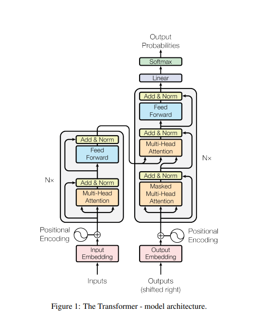

# Transformer Model Implementation

This repository contains a PyTorch implementation of the Transformer model, as described in the paper ["Attention Is All You Need"](https://arxiv.org/pdf/1706.03762.pdf) by Vaswani et al. The Transformer is a powerful neural network architecture that has revolutionized natural language processing tasks.

## Model Architecture

The Transformer model consists of an encoder and a decoder, each composed of multiple layers. The key components of the model are:

1. Self-Attention Mechanism
2. Multi-Head Attention
3. Position-wise Feed-Forward Networks
4. Layer Normalization
5. Positional Encoding

Here's a high-level overview of the model architecture:



## Implementation Details

This implementation includes the following main classes:

- `SelfAttention`: Implements the self-attention mechanism
- `TransformerBlock`: Combines self-attention and feed-forward layers
- `Encoder`: Implements the encoder stack
- `DecoderBlock`: Implements a single decoder layer
- `Decoder`: Implements the decoder stack
- `Transformer`: Combines the encoder and decoder to form the complete model

## Usage

To use the Transformer model:

1. Import the necessary modules:

```python
import torch
from transformer import Transformer
```

2. Initialize the model:

```python
src_vocab_size = 10000
trg_vocab_size = 10000
src_pad_idx = 0
trg_pad_idx = 0

model = Transformer(
    src_vocab_size=src_vocab_size,
    trg_vocab_size=trg_vocab_size,
    src_pad_idx=src_pad_idx,
    trg_pad_idx=trg_pad_idx,
    embed_size=512,
    num_layers=6,
    forward_expansion=4,
    heads=8,
    dropout=0.1,
    device="cuda",
    max_length=100
)
```

3. Prepare your input data:

```python
src = torch.tensor([[...]])  # Source sequence
trg = torch.tensor([[...]])  # Target sequence
```

4. Forward pass through the model:

```python
output = model(src, trg[:, :-1])
```